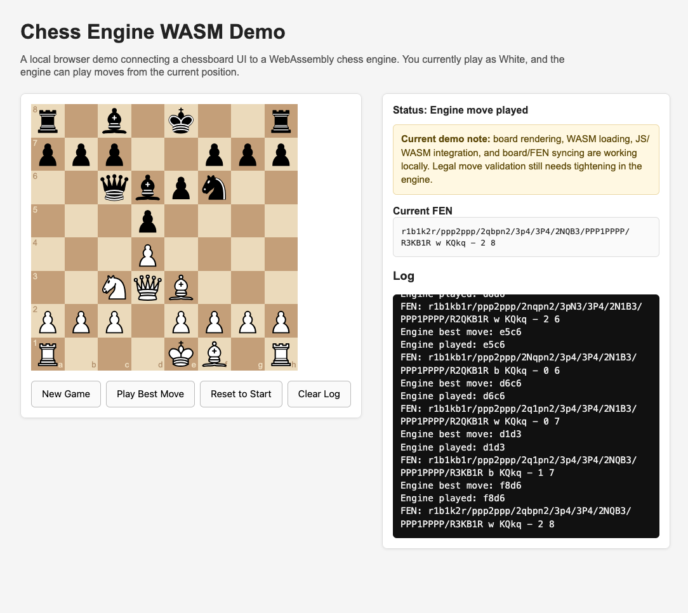

# Chess Engine WASM Demo

A browser-based chess engine demo that connects a custom C chess engine to a web UI using WebAssembly.

This project showcases an end-to-end browser integration flow: chess engine logic in C, compilation to WebAssembly with Emscripten, JavaScript ↔ WASM communication, board rendering in the browser, and a playable frontend deployed through GitHub Pages.

---

## Live Demo

- Portfolio: https://shab00.github.io/
- Chess Demo: https://shab00.github.io/chess/

---

## Overview

The core chess engine is written in C and compiled to WebAssembly using Emscripten. The browser UI is built with HTML, JavaScript, and [`cm-chessboard`](https://github.com/shaack/cm-chessboard), allowing the engine to run directly in the browser without a backend server.

The current demo supports:

- rendering the chessboard in the browser
- loading the WebAssembly engine successfully
- calling engine functions from JavaScript
- syncing the board from engine FEN
- making player moves from the UI
- automatically triggering the engine reply
- rejecting illegal moves through engine validation
- resetting or starting a new game locally

---

## Current Status

This project is currently at the **browser-playable demo milestone** stage.

### What works now

- browser-based board rendering with `cm-chessboard`
- WebAssembly engine startup with no runtime load errors
- JavaScript ↔ WASM engine communication
- board refresh from engine FEN state
- White-side move input from the browser UI
- automatic engine replies as Black after a legal player move
- illegal move rejection through engine-side validation
- a live GitHub Pages demo connected to a portfolio landing page
- local controls for:
  - **New Game**
  - **Engine Move**
  - **Reset to Start**
  - **Clear Log**

### Current limitations

- legal destination squares are not yet restricted or highlighted in the UI
- game-state messaging can still be improved for outcomes like checkmate, stalemate, or no available engine move
- the engine and UI are functional, but there is still room for additional polish and feature expansion

---

## How It Works

- The chess engine is written in C.
- The engine is compiled to WebAssembly with Emscripten.
- The browser loads `engine.js` and `engine.wasm`.
- The UI sends moves from JavaScript to the engine.
- The engine validates moves and updates internal board state.
- The engine returns updated board state as FEN.
- The board redraws from that FEN in the browser.

Everything runs locally in the browser after the page loads, with no backend required for gameplay.

---

## Project Structure

```text
chess-engine-wasm/
  src/           # C source code and WASM wrapper
  docs/          # browser demo files (index.html, engine.js, engine.wasm, assets...)
  README.md
```

---

## Running Locally

From the `docs/` directory, start a simple local server:

```bash
python3 -m http.server
```

Then open:

```text
http://localhost:8000/
```

If you are serving from the project root instead, open the correct `/docs` path for your local setup.

---

## Building the WASM Engine

The engine is compiled from the C source using Emscripten.

Example build approach:

```bash
cd src
emcc engine.c wasm_api.c -o ../docs/engine.js -s WASM=1
```

Depending on your wrapper and build setup, you may also need to export the functions used by the browser UI, such as:

- `wasm_engine_new_game`
- `wasm_engine_get_fen`
- `wasm_engine_make_move`
- `wasm_engine_get_bestmove`
- `wasm_engine_set_fen`

Adjust the exact build command and exported functions to match your implementation.

---

## Controls

The current demo includes:

- **New Game** — starts a fresh game in the engine and refreshes the board
- **Engine Move** — asks the engine for the current best move and plays it
- **Reset to Start** — resets the engine and board to the starting position
- **Clear Log** — clears the log panel

---

## Screenshot



---

## Notable Implementation Work

This project included work across multiple layers of the stack:

- C engine inspection and debugging
- locating and updating the WASM wrapper in `src/wasm_api.c`
- fixing move legality handling so illegal moves are rejected correctly
- connecting engine state updates to the browser board UI
- improving the browser flow so the player moves White and the engine responds automatically as Black
- integrating the demo into a GitHub Pages portfolio site

---

## Next Steps

Possible future improvements include:

- restricting White to legal destination squares directly in the UI
- improving game-over and engine-status messaging
- adding stronger UX polish and additional project write-ups
- continuing to refine the engine and frontend integration

---

## Acknowledgements

Credit and thanks to the tools and communities that helped make this possible:

- [`cm-chessboard`](https://github.com/shaack/cm-chessboard) for the browser chessboard UI
- [Emscripten](https://emscripten.org/) for the C → WebAssembly toolchain
- the wider open-source chess programming community for ideas, references, and inspiration

---

## Contributing

Contributions, suggestions, and bug reports are welcome. Feel free to open an issue or submit a pull request.

---

## License

Add your license details here once confirmed.
